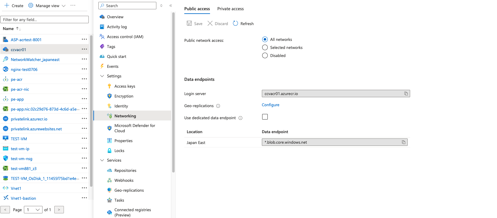
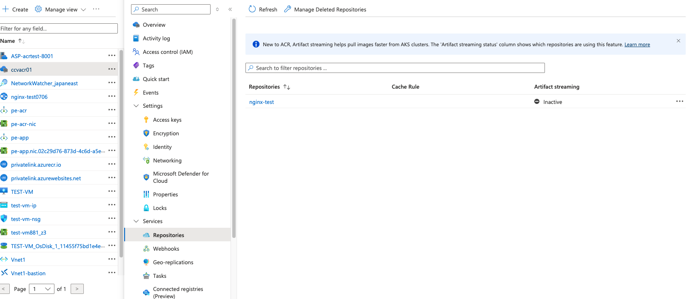

# 閉域網App ServiceからACRのイメージをPullする再現
2024/07/06 初版

メインこの記事を参考して再現したんですが、幾つ落とし穴がありまして、メモします。
https://qiita.com/shingo_kawahara/items/903ab9261d0d87c1d0a2
## 1.VMでイメージ作成、ACRにPUSH部分コマンド
原文ではこのようです。
```
# echo '<h1>ACR Test v1</h1>' > index.html
# echo 'FROM nginx:latest' > Dockerfile
# echo 'COPY index.html /usr/share/nginx/html' >> Dockerfile
# az login
# az account list --output table --all
# az account set --subscription [Subscrption ID]
# az acr build --registry [Container Registry Name] --image nginx-test:v1 .
```
実際には
`az acr build --registry [Container Registry Name] --image nginx-test:v1 .`コマンドうまくいけなくて、本当に使ったコマンドはこのようです。
```
echo '<h1>ACR Test 07062121</h1>' > index.html
echo 'FROM nginx:latest' > Dockerfile
echo 'COPY index.html /usr/share/nginx/html' >> Dockerfile
```
#az cli install　（az初回利用する場合必要）
`
curl -sL https://aka.ms/InstallAzureCLIDeb | sudo bash
`
```
az login
az account list --output table --all
az account set --subscription [Subscrption ID]
```
#docker install　（Docker初回利用の場合、必要）

```sudo apt  install docker.io```

#もしpemission denied /var/run/docker.sockエラー出る場合
`sudo chmod 666 /var/run/docker.sock`

#Login to the ACR using 

`
az acr login -n [Container Registry Name] -u [Container Registry user name] -p [Container Registry secret]`

#build image

`docker build -t nginx-test:latest -f Dockerfile .`

#Tag the image 

`docker tag nginx-test:latest [Container Registry Name].azurecr.io/nginx-test:v3`

#Push the image to ACR from docker - 
`
docker push ccvacr01.azurecr.io/nginx-test:v3
`

## 2.閉域網内App serviceイメージをPULLにはPull image over VNet:ONする必要あります

そうしないとイメージPULLできない

## 3.Public IP閉じるとACRのregistries一覧見れない

イメージPUSH、PULLは正常通りできます。
networking puclic ip有効化にしたら、しばらく（何分間）を待つと、イメージ一覧表示されるようになります。

